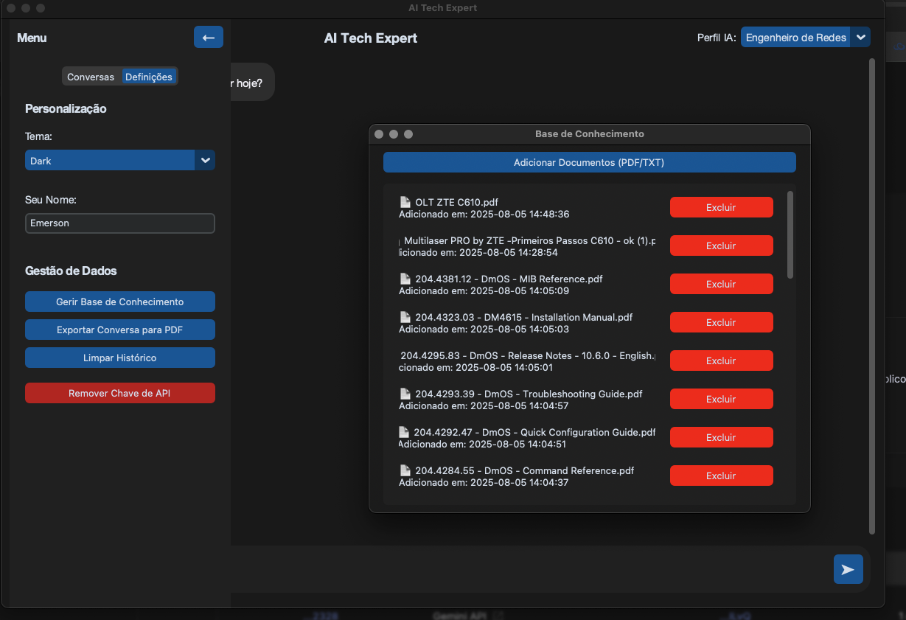

````markdown
# 🤖 AI Tech Expert

Um assistente de desktop inteligente com interface moderna, IA poderosa e base de conhecimento personalizada.

[Screenshot do AI Tech Expert](assets/1.png)


---

## 🚀 Sobre o Projeto

O **AI Tech Expert** vai muito além de um simples chatbot: é uma ferramenta de produtividade com inteligência artificial, desenvolvida em **Python**, que utiliza a **API Google Gemini 1.5 Flash**.

A IA é capaz de:
- Ler e entender **documentos locais** (PDFs e TXTs),
- Assumir **perfis de especialista** que adaptam o tom e a profundidade técnica das respostas.

---

## ✨ Funcionalidades

### ✅ Perfis de Especialistas
- **Engenheiro de Redes**
- **SysAdmin Linux**
- **Professor Didático**
- *...e outros perfis que você pode adicionar!*

### 📂 Base de Conhecimento Personalizada
- Faça upload de PDFs, artigos técnicos ou manuais.
- A IA consulta seus arquivos como fonte primária.



### 🖼️ Interface Moderna com CustomTkinter
- Visual clean, temas claro e escuro.
- Navegação fluida e responsiva.


### 🗃️ Gestão de Conversas
- Histórico de chats salvo automaticamente.
- Interface para apagar conversas antigas.

### 🔒 Segurança de API
- Sua chave da API Gemini é salva com segurança usando o **Keyring** do sistema operacional.

### 🛠️ Comunicação Resiliente com a API
- Controle inteligente de **tokens**.
- Tentativas automáticas em caso de falha na requisição.

---

## 🛠️ Tecnologias Utilizadas

| Componente        | Descrição                                  |
|-------------------|---------------------------------------------|
| **Linguagem**     | Python 3.10+                                |
| **GUI**           | CustomTkinter                               |
| **Backend**       | Flask (servidor local)                      |
| **IA**            | Google Gemini API (gemini-1.5-flash-latest) |
| **Banco de Dados**| SQLite                                      |
| **Leitor de PDFs**| PyPDF2                                      |
| **Segurança**     | Keyring (armazenamento seguro de API key)  |

---

## ⚙️ Como Executar

### ✅ Pré-requisitos

- Python 3.10 ou superior
- Conta no Google Cloud com acesso à Gemini API
- Chave de API válida do Gemini

---

> [!TIP] 
>🧰 Instalação
```bash
# Clone o repositório
git clone https://github.com/EmersonRicardo0/AI-Tech-Expert.git
cd AI-Tech-Expert

# Crie o ambiente virtual
python3 -m venv venv

# Ative o ambiente virtual
source venv/bin/activate      # macOS/Linux
venv\Scripts\activate.bat     # Windows (cmd)

# Instale as dependências
pip install -r requirements.txt
````

---

## 🚀 Execução

### 1. Inicie o servidor Flask (em um terminal separado):

```bash
python server.py
```

### 2. Inicie a interface gráfica:

```bash
python main.py
```

> 🧠 Na primeira execução, será solicitada sua chave da API Gemini. Ela será salva de forma segura com **keyring**.

---

## 📁 Estrutura do Projeto

```
AI-Tech-Expert/
├── assets/
│   ├── ai_icon.png
│   ├── user_icon.png
│   └── screenshot.png
├── app_gui.py
├── server.py
├── gemini_integration.py
├── database.py
├── config.py
├── main.py
├── requirements.txt
└── README.md
```

---

## 🧪 Status do Projeto

✅ MVP funcional
🚧 Em desenvolvimento contínuo
🧩 Aberto para contribuições futuras

---

## 📄 Licença

Este projeto está sob a licença MIT. Veja o arquivo `LICENSE` para mais detalhes.

---

## 🤝 Contribuindo

Pull requests são bem-vindos! Para mudanças importantes, abra uma issue primeiro para discutir o que você gostaria de mudar.

---

## ✉️ Contato

Desenvolvido com 💻 por **Emerson Silva Ricardo**
📧 [silvaemerson797@gmail.com](mailto:emerson.ricardo@gmail.com)

---

```

Se quiser, posso te ajudar a gerar esse `README.md` direto em um arquivo. Só dizer "gera o arquivo aí" que eu já te entrego prontinho pra usar!

Curtiu o visual e organização? Quer adicionar selo de build, GIF ou badge? Posso turbinar isso ainda mais! 💪
```
