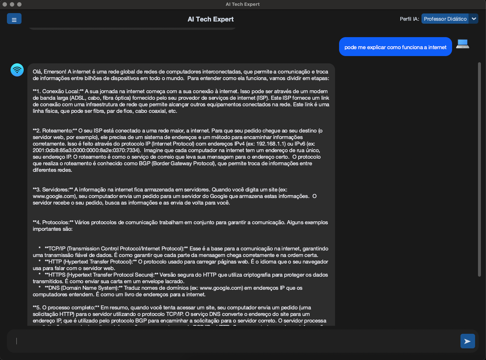
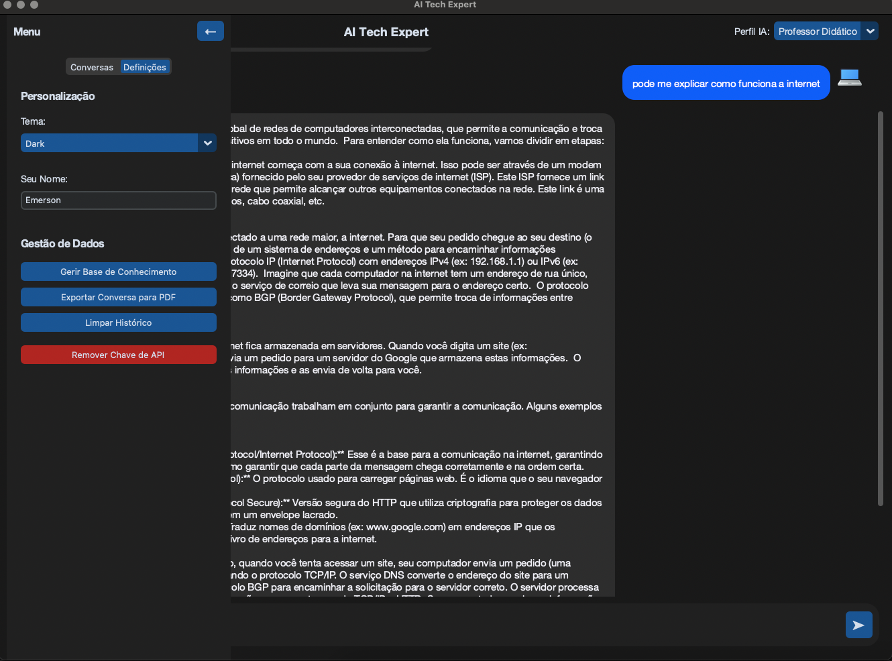

AI Tech Expert 🤖
Um assistente de desktop inteligente com interface moderna, IA poderosa e base de conhecimento personalizada.

🚀 Sobre o Projeto
O AI Tech Expert vai muito além de um simples chatbot: é uma ferramenta de produtividade com inteligência artificial, desenvolvida em Python, que utiliza a API Google Gemini 1.5 Flash. Ele permite consultas inteligentes com base em documentos locais (PDFs e TXTs) e perfis de IA dinâmicos, adaptando o tom e a profundidade técnica das respostas de acordo com o perfil selecionado.

✨ Funcionalidades
✅ Perfis de Especialistas
Altere entre perfis como Engenheiro de Redes, SysAdmin Linux ou Professor Didático.

📂 Base de Conhecimento Personalizada
Adicione seus próprios arquivos (PDFs, manuais, artigos) para que a IA utilize como fonte.

🖼️ Interface Moderna com CustomTkinter
Tema claro e escuro, visual clean, fácil de navegar.

🗃️ Gestão de Conversas
Histórico de chats salvo automaticamente, com opção de apagar.

🔒 Segurança de API
A chave da API Gemini é armazenada com segurança usando o Keyring do sistema operacional.

🛠️ Resiliência na Comunicação com a API
Controle de limites de tokens e tentativas automáticas em caso de falhas.

🛠️ Tecnologias Utilizadas
Componente	Descrição
Linguagem	Python 3.10+
GUI	CustomTkinter
Backend	Flask (servidor local)
IA	Google Gemini API (gemini-1.5-flash-latest)
Banco de Dados	SQLite
Leitor de PDFs	PyPDF2
Segurança	Keyring para armazenamento seguro da API key

⚙️ Como Executar
✅ Pré-requisitos
Python 3.10 ou superior

Conta no Google Cloud com acesso à Gemini API

Chave de API do Gemini

🧰 Instalação
bash
Copiar
Editar
# Clone o repositório
git clone https://github.com/EmersonRicardo0/AI-Tech-Expert.git
cd AI-Tech-Expert

# Crie o ambiente virtual
python3 -m venv venv

# Ative o ambiente virtual
source venv/bin/activate      # macOS/Linux
# venv\Scripts\activate.bat   # Windows (cmd)

# Instale as dependências
pip install -r requirements.txt
🚀 Execução
1. Inicie o servidor Flask (em um terminal separado):

bash
Copiar
Editar
python server.py
2. Inicie a interface gráfica:

bash
Copiar
Editar
python main.py
🧠 Dica: Na primeira execução, o app pedirá sua chave da API Gemini. Ela será salva com segurança via keyring.

📂 Estrutura do Projeto
pgsql
Copiar
Editar
AI-Tech-Expert/
├── assets/
│   ├── ai_icon.png
│   ├── user_icon.png
│   └── screenshot.png
├── app_gui.py
├── server.py
├── gemini_integration.py
├── database.py
├── config.py
├── main.py
├── requirements.txt
└── README.md
